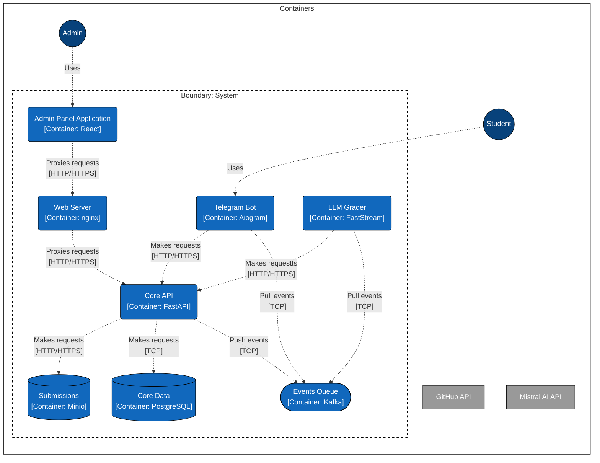

# LLM Grading

## Архитектура



## Запуск

### Переменные окружения

```env
# Core API
PLATFORM_ADMIN_USER=admin
PLATFORM_ADMIN_PASSWORD=password
# Postgres
POSTGRES_DB=grading
POSTGRES_USER=postgres
POSTGRES_PASSWORD=password
# Minio
MINIO_ROOT_USER=minio
MINIO_ROOT_PASSWORD=password
MINIO_ACCESS_KEY=<SET-LATER>
MINIO_SECRET_KEY=<SET-LATER>
# Kafka
KAFKA_BOOTSTRAP_SERVERS=localhost:29092
KAFKA_UI_ADMIN_LOGIN=admin
KAFKA_UI_ADMIN_PASSWORD=password
# Mistral API
MISTRAL_API_KEY=<SET-LATER>
MISTRAL_MODEL=codestral-latest
```

### Инструкция по изначальному запуску

1. Запустить minio `docker-compose up -d minio`
2. Зайти в админку Minio по http://localhost:9001/login под кредами MINIO_ROOT_USER/MINIO_ROOT_PASSWORD
3. Перейти по http://localhost:9001/access-keys и создать access key
4. Скопировать данные по созданному ключу в env MINIO_ACCESS_KEY, MINIO_SECRET_KEY
5. Запустить контейнеры для Kafka `docker-compose up -d zookeeper kafka kafka-ui`
6. Зайти в админку Kafka UI по http://localhost:8090/auth под кредами KAFKA_UI_ADMIN_LOGIN/KAFKA_UI_ADMIN_PASSWORD
7. Перейти по http://localhost:8090/ и убедиться, что кластер живой
8. Запустить остальные контейнеры `docker-compose up -d postgres api grader`
